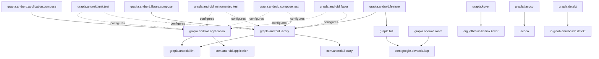

# Convention Plugins Overview

A visual guide to all available convention plugins in the Grapla project.

## 📊 Plugin Categories

```
Convention Plugins (20 total)
│
├── 🚀 Application (3)
│   ├── grapla.android.application
│   ├── grapla.android.application.compose
│   └── grapla.android.application.firebase
│
├── 📚 Library (2)
│   ├── grapla.android.library
│   └── grapla.android.library.compose
│
├── ⭐ Feature (1)
│   └── grapla.android.feature
│
├── 🧪 Testing (4)
│   ├── grapla.android.test
│   ├── grapla.android.unit.test           [NEW]
│   ├── grapla.android.instrumented.test   [NEW]
│   └── grapla.android.compose.test        [NEW]
│
├── 📊 Coverage (2)
│   ├── grapla.kover                       [NEW]
│   └── grapla.jacoco                      [NEW]
│
├── 🔍 Quality (1)
│   └── grapla.detekt                      [NEW]
│
├── 🎨 Flavor (1)
│   └── grapla.android.flavor              [NEW]
│
├── 🔧 Infrastructure (3)
│   ├── grapla.hilt
│   ├── grapla.android.room
│   └── grapla.android.lint
│
└── ☕ JVM (1)
    └── grapla.jvm.library
```

## 🎯 Common Plugin Combinations

### Full-Featured App Module

```kotlin
plugins {
    id("grapla.android.application")           // Base app setup
    id("grapla.android.application.compose")   // Compose UI
    id("grapla.hilt")                          // Dependency injection
    id("grapla.android.flavor")                // Build variants [NEW]
    id("grapla.kover")                         // Code coverage [NEW]
    id("grapla.detekt")                        // Code quality [NEW]
}
```

### Feature Module (Recommended)

```kotlin
plugins {
    id("grapla.android.feature")               // Feature base (includes library + hilt)
    id("grapla.android.library.compose")       // Compose support
    id("grapla.android.unit.test")             // Unit testing [NEW]
    id("grapla.android.compose.test")          // Compose UI tests [NEW]
    id("grapla.kover")                         // Coverage tracking [NEW]
    id("grapla.detekt")                        // Code quality [NEW]
}
```

### Data/Repository Module

```kotlin
plugins {
    id("grapla.android.library")               // Base library
    id("grapla.android.room")                  // Database
    id("grapla.hilt")                          // DI
    id("grapla.android.unit.test")             // Unit tests [NEW]
    id("grapla.android.instrumented.test")     // Integration tests [NEW]
    id("grapla.jacoco")                        // Coverage [NEW]
    id("grapla.detekt")                        // Code quality [NEW]
}
```

### UI Component Library

```kotlin
plugins {
    id("grapla.android.library")               // Base library
    id("grapla.android.library.compose")       // Compose UI
    id("grapla.android.unit.test")             // Unit tests [NEW]
    id("grapla.android.compose.test")          // UI tests [NEW]
    id("grapla.kover")                         // Coverage [NEW]
}
```

### Domain/Use Case Module

```kotlin
plugins {
    id("grapla.jvm.library")                   // Pure Kotlin
    id("grapla.android.unit.test")             // Unit tests [NEW]
    id("grapla.kover")                         // Coverage [NEW]
    id("grapla.detekt")                        // Code quality [NEW]
}
```

## 🔄 Plugin Dependencies



## 📖 Plugin Reference

### Application Plugins

| Plugin | Purpose | Applies |
|--------|---------|---------|
| `grapla.android.application` | Base Android app configuration | `com.android.application`, `kotlin-android`, `grapla.android.lint` |
| `grapla.android.application.compose` | Jetpack Compose for apps | `grapla.android.application` |
| `grapla.android.application.firebase` | Firebase integration | `grapla.android.application` |

### Library Plugins

| Plugin | Purpose | Applies |
|--------|---------|---------|
| `grapla.android.library` | Base Android library | `com.android.library`, `kotlin-android`, `grapla.android.lint` |
| `grapla.android.library.compose` | Compose for libraries | `grapla.android.library` |

### Feature Plugin

| Plugin | Purpose | Applies |
|--------|---------|---------|
| `grapla.android.feature` | Feature module setup | `grapla.android.library`, `grapla.hilt` |

### Testing Plugins [NEW]

| Plugin | Purpose | Includes |
|--------|---------|----------|
| `grapla.android.test` | Test module configuration | AndroidX Test, JUnit |
| `grapla.android.unit.test` | Unit test setup | JUnit 6, Kotlin Test, Truth, Turbine, Robolectric |
| `grapla.android.instrumented.test` | Device test setup | Espresso, UI Automator, AndroidX Test |
| `grapla.android.compose.test` | Compose UI test setup | Compose Test, Navigation Testing |

### Coverage Plugins [NEW]

| Plugin | Purpose | Best For |
|--------|---------|----------|
| `grapla.kover` | Kotlin-first coverage | Kotlin modules, better performance |
| `grapla.jacoco` | Java/Kotlin coverage | Mixed Java/Kotlin, industry standard |

### Quality Plugins [NEW]

| Plugin | Purpose | Features |
|--------|---------|----------|
| `grapla.detekt` | Static code analysis | Code smells, complexity, style checks |

### Flavor Plugins [NEW]

| Plugin | Purpose | Dimensions |
|--------|---------|------------|
| `grapla.android.flavor` | Build variant config | environment (dev, staging, prod), version (free, paid) |

### Infrastructure Plugins

| Plugin | Purpose | Applies |
|--------|---------|---------|
| `grapla.hilt` | Dependency injection | `dagger.hilt.android`, `ksp` |
| `grapla.android.room` | Database setup | `androidx.room`, `ksp` |
| `grapla.android.lint` | Lint configuration | Lint rules |

### JVM Plugin

| Plugin | Purpose | Applies |
|--------|---------|---------|
| `grapla.jvm.library` | Pure Kotlin library | `kotlin-jvm` |

## 🎨 Plugin Selection Guide

### By Module Type

```
App Module
├── Required: grapla.android.application
├── UI: grapla.android.application.compose
├── DI: grapla.hilt
├── Variants: grapla.android.flavor [NEW]
├── Coverage: grapla.kover OR grapla.jacoco [NEW]
└── Quality: grapla.detekt [NEW]

Feature Module
├── Required: grapla.android.feature (includes library + hilt)
├── UI: grapla.android.library.compose
├── Testing: grapla.android.unit.test [NEW]
├── UI Testing: grapla.android.compose.test [NEW]
├── Coverage: grapla.kover [NEW]
└── Quality: grapla.detekt [NEW]

Data Module
├── Required: grapla.android.library
├── Database: grapla.android.room
├── DI: grapla.hilt
├── Testing: grapla.android.unit.test [NEW]
├── Integration: grapla.android.instrumented.test [NEW]
├── Coverage: grapla.jacoco [NEW]
└── Quality: grapla.detekt [NEW]

UI Module
├── Required: grapla.android.library
├── Compose: grapla.android.library.compose
├── Testing: grapla.android.unit.test [NEW]
├── UI Testing: grapla.android.compose.test [NEW]
└── Coverage: grapla.kover [NEW]

Domain Module
├── Required: grapla.jvm.library
├── Testing: grapla.android.unit.test [NEW]
├── Coverage: grapla.kover [NEW]
└── Quality: grapla.detekt [NEW]
```

## 🚦 Adoption Levels

### Level 1: Basic (Existing)

```kotlin
plugins {
    id("grapla.android.library")
}
```

### Level 2: With Testing [NEW]

```kotlin
plugins {
    id("grapla.android.library")
    id("grapla.android.unit.test")          // [NEW]
}
```

### Level 3: With Coverage [NEW]

```kotlin
plugins {
    id("grapla.android.library")
    id("grapla.android.unit.test")          // [NEW]
    id("grapla.kover")                      // [NEW]
}
```

### Level 4: With Quality [NEW]

```kotlin
plugins {
    id("grapla.android.library")
    id("grapla.android.unit.test")          // [NEW]
    id("grapla.kover")                      // [NEW]
    id("grapla.detekt")                     // [NEW]
}
```

### Level 5: Full Stack [NEW]

```kotlin
plugins {
    id("grapla.android.library")
    id("grapla.android.library.compose")
    id("grapla.android.unit.test")          // [NEW]
    id("grapla.android.compose.test")       // [NEW]
    id("grapla.kover")                      // [NEW]
    id("grapla.detekt")                     // [NEW]
}
```

## 📈 Coverage & Quality Commands

### Coverage (Kover)

```bash
./gradlew koverHtmlReport      # Generate HTML report
./gradlew koverXmlReport       # Generate XML report
./gradlew koverVerify          # Verify coverage thresholds
./gradlew koverLog             # Print coverage to console
```

### Coverage (JaCoCo)

```bash
./gradlew jacocoTestReport     # Unified report
./gradlew jacocoDebugReport    # Debug variant
./gradlew jacocoReleaseReport  # Release variant
```

### Quality (Detekt)

```bash
./gradlew detekt               # Run static analysis
./gradlew detektBaseline       # Create baseline
./gradlew detekt --auto-correct # Auto-fix issues
```

### Testing

```bash
./gradlew test                 # Unit tests
./gradlew connectedAndroidTest # Instrumented tests
```

### Combined Quality Check

```bash
./gradlew clean detekt test koverVerify
```

## 🎯 Benefits Summary

### Before (11 plugins)

✅ Basic module configuration  
✅ Compose support  
✅ Hilt integration  
✅ Room database  
✅ Basic testing

### After (20 plugins, +9 new)

✅ Basic module configuration  
✅ Compose support  
✅ Hilt integration  
✅ Room database  
✅ Basic testing  
✨ **Advanced unit testing (JUnit 6, Robolectric)**  
✨ **Instrumented testing (Espresso, UI Automator)**  
✨ **Compose UI testing**  
✨ **Code coverage (Kover & JaCoCo)**  
✨ **Static code analysis (Detekt)**  
✨ **Build flavor configuration**

## 📚 Documentation

- [README.md](./README.md) - Overview and quick start
- [STRUCTURE.md](./STRUCTURE.md) - Detailed structure
- [PLUGIN_GUIDE.md](./PLUGIN_GUIDE.md) - Comprehensive usage guide
- [NEW_PLUGINS_SUMMARY.md](./NEW_PLUGINS_SUMMARY.md) - New plugins summary
- [PLUGINS_OVERVIEW.md](./PLUGINS_OVERVIEW.md) - This file

---

**Legend**: [NEW] = Recently added plugin
